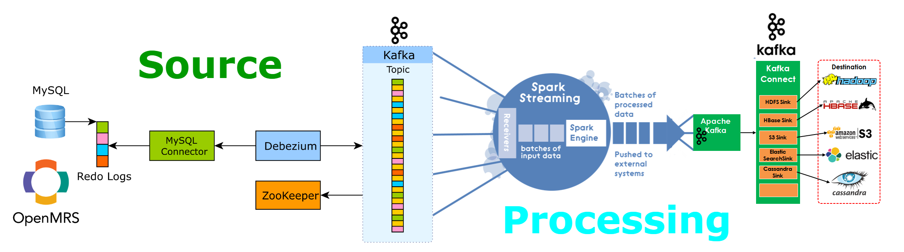
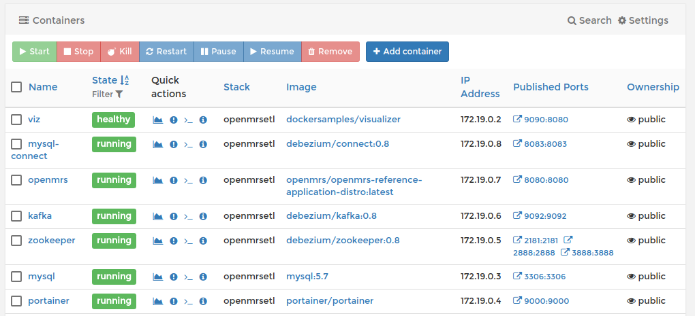
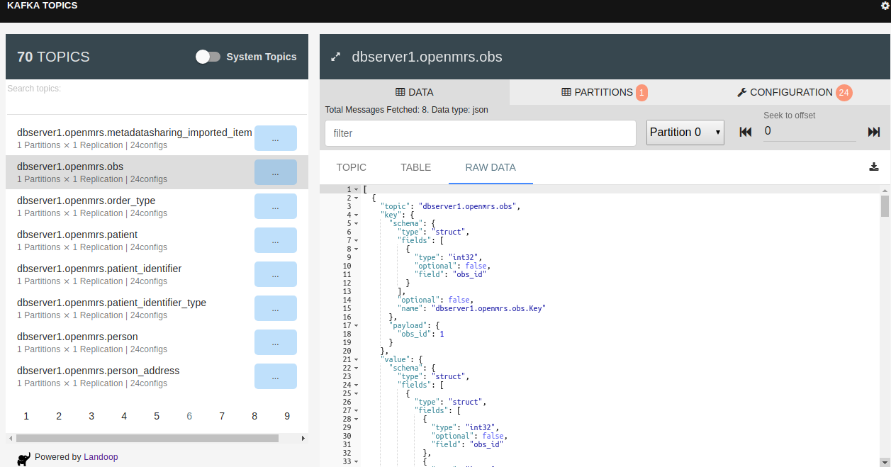

# Openmrs Real-time Streaming Topology


- The motivation of this project is to provide ability of processing data in **real-time**
 from various sources like openmrs, eid, e.t.c
 

## Requirements
Make sure you have the latest docker and docker compose
1. Install [Docker](http://docker.io).
2. Install [Docker-compose](http://docs.docker.com/compose/install/).
3. Clone this repository

# Getting started 
You will only have to run only 3 commands to get the entire cluster running. Open up your terminal and run these commands:

```shell
# this will install  5 containers (mysql, kafka, connect (dbz), openmrs, zookeeper, portainer and cAdvisor)
# cd /media/sf_akimaina/openmrs-etl
export DEBEZIUM_VERSION=0.8
docker-compose -f docker-compose.yaml up

# Start MySQL connector
curl -i -X POST -H "Accept:application/json" -H  "Content-Type:application/json" http://localhost:8083/connectors/ -d @register-mysql.json


# build and run spark cluster. (realtime streaming and processing)
# https://www.youtube.com/watch?v=MNPI925PFD0
sbt package
sbt run 
 

```

If everything runs as expected, expect to see all these containers running:



You can access this here: http://localhost:9000


## Openmrs
Openmrs Application will be eventually accessible on http://localhost:8080/openmrs.
Credentials on shipped demo data:
  - Username: admin
  - Password: Admin123
  
## Spark Jobs Monitor & Visualization
http://localhost:4040

## Docker Container Manager: Portainer
http://localhost:9000


  
# MySQL client

    docker-compose -f docker-compose.yaml exec mysql bash -c 'mysql -u $MYSQL_USER -p$MYSQL_PASSWORD inventory'
    

## Schema Changes Topic
 
    docker-compose -f docker-compose.yaml exec kafka /kafka/bin/kafka-console-consumer.sh     --bootstrap-server kafka:9092     --from-beginning     --property print.key=true     --topic schema-changes.openmrs

## How to Verify MySQL connector (Debezium)
 
    curl -H "Accept:application/json" localhost:8083/connectors/

## Shut down the cluster
    
    docker-compose -f docker-compose.yaml down

## cAdvisor: Docker & System Performance
http://localhost:9090

## Debezium Topics

 
 #### Consume messages from a Debezium topic [obs,encounter,person, e.t.c]
 - All you have to do is change the topic to  --topic dbserver1.openmrs.<tableName>
 
 ```shell
    docker-compose -f docker-compose.yaml exec kafka /kafka/bin/kafka-console-consumer.sh \
     --bootstrap-server kafka:9092 \
     --from-beginning \
     --property print.key=true \
     --topic dbserver1.openmrs.obs
 ``` 
## Cluster Design Architecture
- This section attempts to explain how the clusters work by breaking everything down
- Everything here has been dockerized so you don't need to do these steps
    
    * Kafka Cluster: [Kafka](kafka.md)
    * Spark Cluster: [Spark](spark.md)
    * Debezium Layer: [Debezium](debezium.md)

## Directory Structure
```
project
│   README.md 
│   kafka.md  
│   debezium.md
│   spark.md
│   docker-compose.yaml
│   build.sbt
│
└───src
│   │   file011.txt
│   │   file012.txt
│   │
│   └───subfolder1
│       │   file111.txt
│       │   file112.txt
│       │   ...
│   
└───project
    │   file021.txt
    │   file022.txt
```


## KAFKA CLUSTER DESIGN CONCERN


0. How many brokers will we have? this will determine how scalable and fast the 
    cluster will be.
1. How many producers  & consumers will we need inorder to ingest and process encounter,
    obs,orders,person e.t.c?
2. How many partitions will we have per topic? 
    - we will definitely need to come with an intelligent way of calculating number of partition per topic.
    - keeping in mind that this is correlated with "fault tolerance" and speed of access 
3. Will we allow automatic partition assignment or go manual?
    - going manual is crucial for parallel processing
4. will we need consumer group in this design 
    - keep in mind that the obs producer will have so many transactions in parallel
5. What Replication factor (RF)? RF is number of copies of each partition stored on different brokers 
    - Keeping in mind replication factor is used to achieve fault tolerance
    - it also depends on number Brokers we will have.  
    - should be predetermined and set during topic creation
    
6. Kafka doesn't retain data forever that's not it's work. There are 2 properties log.retention.ms  and
    log.retention.bytes which determines retention. default is 7 days
    - log.retention.ms - retention by time (default is 7 day) **data will be deleted after 7 days** 
    - log.retention.bytes - retention by size (size is applicable to partition)
    
7. How many times  should we set the producer to retry after getting an error (default is 0)
8. order of delivery in asynchronous send is not guaranteed? could this be a potential threat
9. Do we need to use consumer group (this can scale up speed of processing)
    - we will have to consider designing for rebalancing using offset
    - why do we even need it ?
        - allows you to parallel process a topic
        - automatically manages partition assignment
        - detects entry/exit/failure of a consumer and perform partition rebalancing
10. What about autocommit? should we override it to false
    - this will allow us to ensure that we don't lose data from the pipline incase our permanent storage service goes down just intime after data processing
11. Schema evolution design strategy
    - so that our producers and consumers can evolve - otherwise we will have to create duplicate producers
     and consume in case of changes in the             