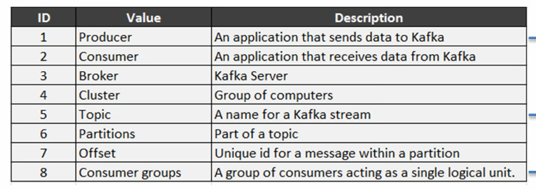
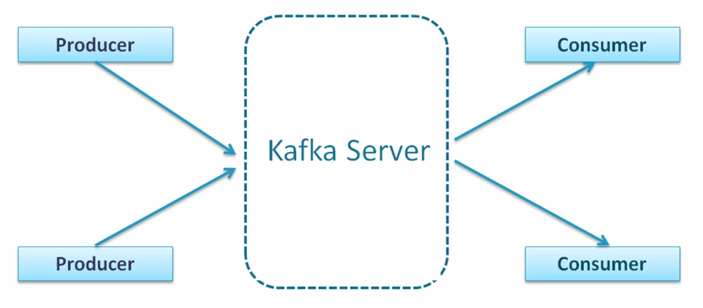
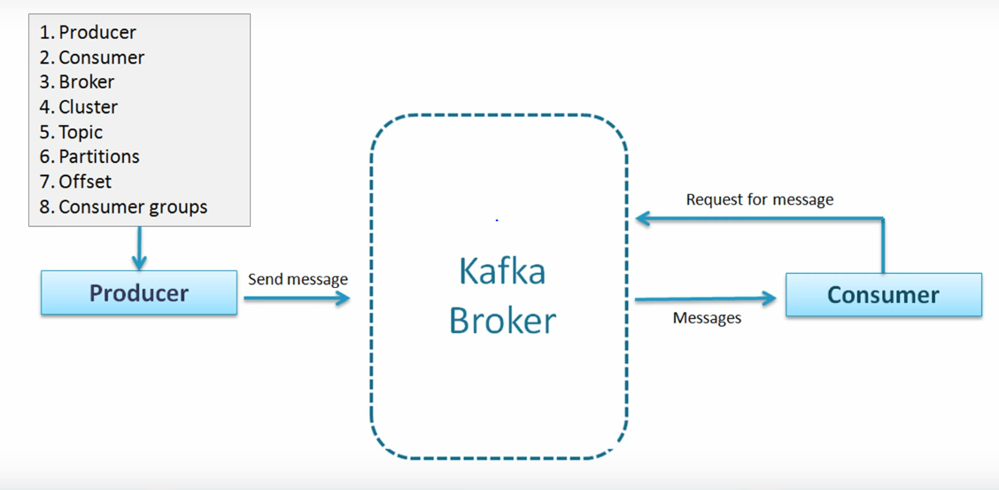
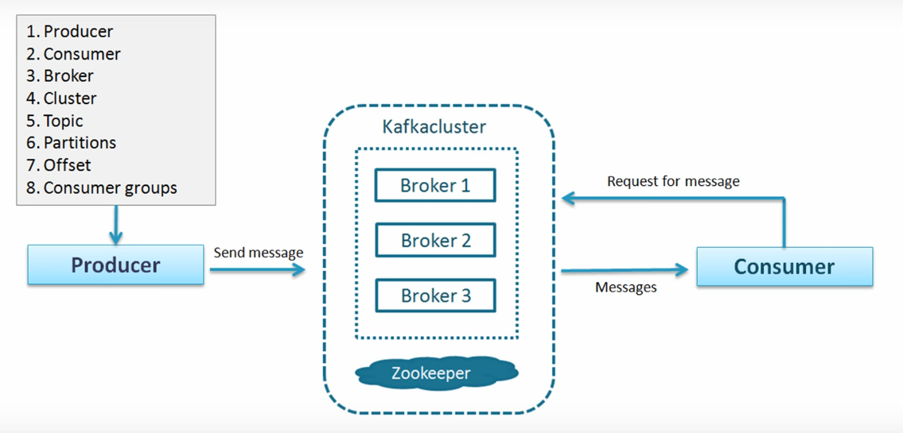
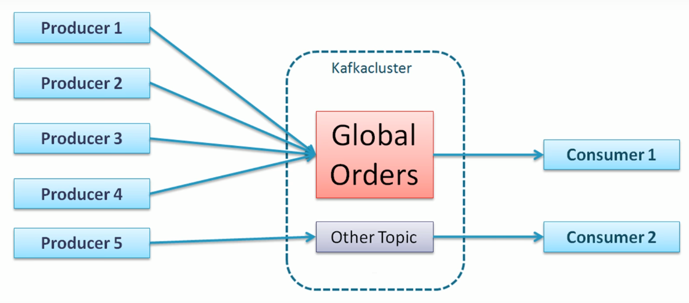
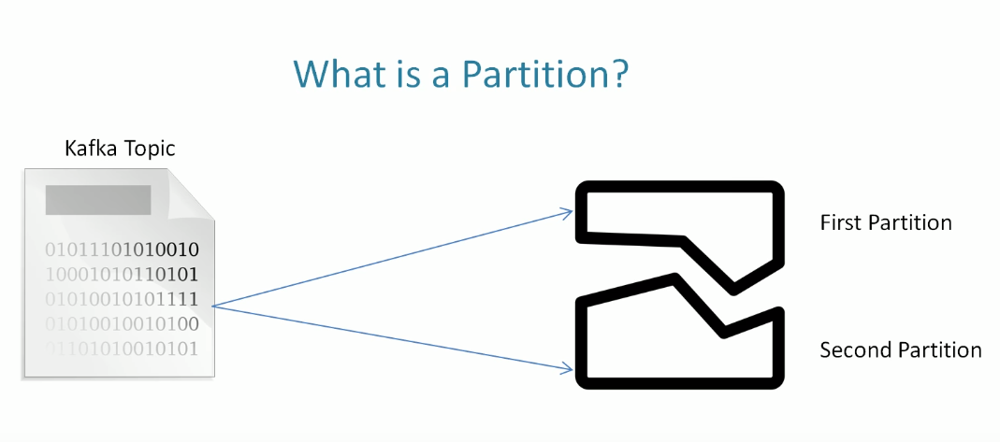
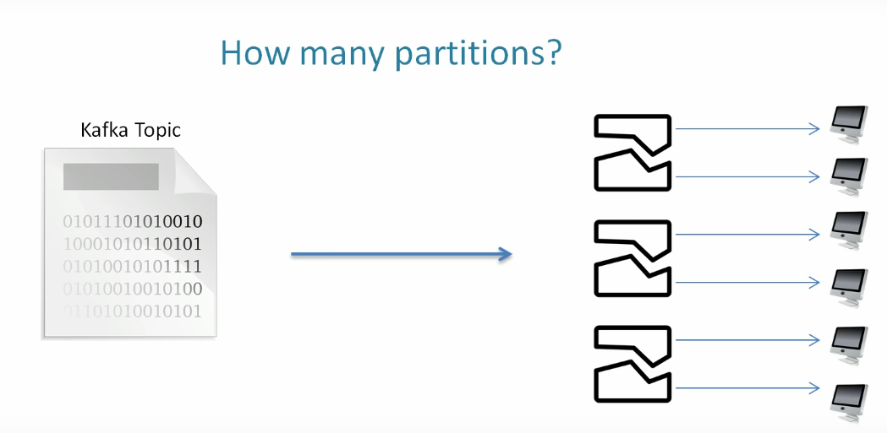
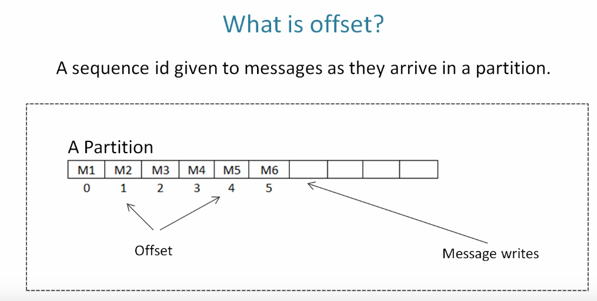
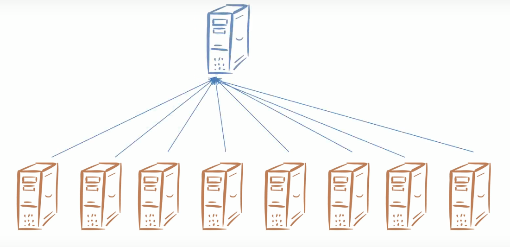
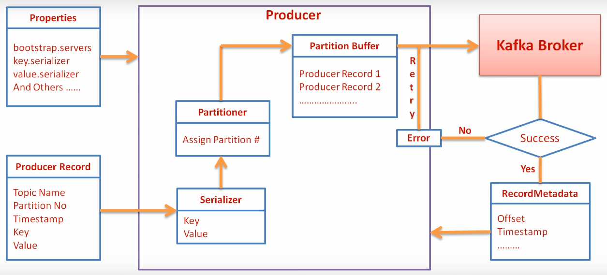

## Kafka Basics

- kafka is a distributed streaming platform which can be used 
  for stream processing and a connector to import and export 
  bulk data from databases and other systems
  
  
   
* **producer** 
     
    - is an application that sends messages to kafka (publisher)

* **message** 
    - is a small to medium sized piece of data (key-value pair)
        - programmatically you need to convert to bytes (kafka only accepts bytes)
        
* **consumer** 
    
    - is an app/process that receives data from kafka (subscriber)
     

* **broker** 
    
    - is a single kafka server 

* **cluster** 
    - group of computers (brokers)


* **Topic** 
    
    - A unique name for a kafka(data) stream
        - push message to a particular topic

* **partitions** 
    
    - part of a topic 
    - a topic can be really huge (100gb+) 

Why partition a topic? 
- a topic can be larger than the space in a single computer (broker).
    - In this case the broker might have challenge in storing the whole topic.
    - The obvious solution is to distribute parts of the topic to  multiple brokers as partitions.
    - 
    - Every partition sits on a single machine (you cant break it further)
    - Every partition has a unique index id (per topic)
                 
* **Offset** 
    
    - unique id for a message within a partition
    - this index is assigned as message arrives (in order of arrival)
    - this id is immutable
    - it is a global unique identifier of a message
    - for you to access a particular message you need (topicName -> partitionNum -> offset)
    
* **consumer groups** 
    
    - a group of consumers acting as a single logic unit (scalability)
    
    Why do we need to create a group? 
    - many consumer form a group to share work 
    - think of it as groupWork where each member works
      on a unit of the larger task (divide and conquer) 
    - when datastream becomes too huge for a consumer to handle, 
      you need to divide the task (partitions) to multipe consumers called consumer group
    - this is highly useful to increase speed of processing  and scalability
    - this is a tool for scalability
    - note that max number of consumers in a group is equal to total number of 
      partition in a topic
    - kafka doesnt allow more than 2 consumers to read on the same partition simultaneously
        (in order to avoid double reading of records)  

 

## How it works
- the following are cmds for starting up a kafka-debzium cluster using shell script (this can be docarized)
- this project has docarized most of these steps
- other steps(logic) have been coded using scala
- data transformation is handled by spark
- Note that these steps are here only for demo on how the topology works. consumer api and 
   producer api have been used in this project using scala

#### Step 0: install kafka
- not necessary if you docaraize
#### Step 1: start zookeeper
* **zookeeper** 
    
    - coordinate brokers and maintains their config inorder to avoid race conditions
    - necessary for creating a cluster.
    - kafka is shipped with zookeeper
    - cmd: bin/zookeeper-server-start.sh config/zookeeper.properties  
    - config/zookeeper.properties  is the default config file
    - default port is 2181
    - THIS MUST BE STARTED BEFORE KAFKA IS STARTED
    
#### Step 2: Install kafka
* **kafka broker** - server
    - need a config file
    - cmd: bin/kafka-server-start.sh config/server.properties  
    - config/server.properties  is the default config file
    - each broker must have individual config file with unique props:
        - broker.id
        - port number
        - log.dirs
    - default port is 9092
    - kafka creates topic by default automatically if you send message without specifying
                
* **kafka topic** -
    - cmd: 
    ```shell
    bin/kafka-server-topic.sh 
        --zoookeeper localhost:2181 
        --create --topic abctopic --partition 2 
        --repication-factor 1
    ```
        
     - repication-factor 
        - number of copies of each partition stored on different brokers
          
     - how to get full details of a topic
        - cmd:  
        ```shell
        bin/kafka-server-topic.sh 
                    --zoookeeper localhost:2181 
                    --describe --topic abctopic
        ```
                    
     - ISR means In sync replica 
            - you can have multiple replicas but not all are insync with the leader 
            - isr shows the number of replicas that are insync with the leader
 
* **kafka producer** 
 
Here is the producer Workflow
  
 1. **create property object**
    - acks 
        - acks=0 (producer will not wait for ack), 
            - loss of msgs
            - high throughput
            - no retries
        - acks=1 (producer wil wait for ack from only the leader broker)
            - chances of loss is thinnner
            - followers might loose 
        -  acks=all (leader will wait untill all followers send ack before sending ack to producer)
            - slowest option
            - no loss
            - highest reliable but has  highest latency 
        - retries - how many times the producer will retry after getting an error (default is 0)
        - retry.backof.ms - time between 2 retries. default is 100 ms
        - max.in.flight.requests.per.connection - in async send how many msg you can send without getting feedback
            - increasing this value will increase memory usage and increase throughput
            - order of delivery is not guaranteed (set it to 1 if you prefer order)
 2. create producer object
 3. create producer record object
 4. Instantiate producer object
 5. Serialization -convert to byte
     - strings, int, double and long
     - custom serializers but avoid using them (there are millions of generic serializers)
     - a good example of custom serializers is avro
     - creating a custom serializer you need deserializers
  
 6. Partitioner assign partition # depending on key and partition properties
    - using key can result to 
    - using custom partitioner
 7. Producer keeps the message in memory on the **partition buffer**
    - this is configurable
 8. Producer sends the batch to the broker
    - if success the broker sends ack
    - if error occures the producer will retry
        - time and number of retry is configurable   
    - callback and Ack
        Approaches used by kafka
        - Send and forget: 
            - producer send msg to broker and doesn't care if it was received or not 
            - you might lose message be careful
        - Synchronous send:
            - Send a message and wait untill we get a response
                - Success: we get a record metadata object (most of the time we dont care abt it)
                - Exception: error message - we care because we want log error message
            - this method is blocking because it limits you wait to wait for response before doing anything else
            - throughput is minimized because of network delay
        
        - Asynchronous send
            - high throughput
            - send message and provide callback function to receive ack (record metadata obj)
            - disadvantage is you might loose order of your message log in the partition residing at the broker
     
- cmd: 
```shell
bin/kafka-console-producer.sh --broker-list localhost:9092 
        --topic abctopic
```
- programmatically you need:
    
    - step 1: to create  KafkaProducerObject (Producer <String>)
        - 3 props are mandatory
            - bootstrap.servers. (provide multiple)
            - key.serializer. 
            - value.serializers
                    
    - step 2: then create (ProducerRecord <String>) 
     
        - here u specify topicName and message (key and value)
        - you can also specify timestamp and partition
        - sending 1000 messages using same key will land in one partition (*if partition is not specified)
        - If you don't send key, then kafka will distribute evenly your messages on partitions 
        - if you hard code partition then your message will land on that specifid parttion
        - if You dont set timeStamp, kafka will set it by default 
        
    - step 3: close that kafkaProducerObject
   

     
                            
* **kafka consumer** 
    - cmd: 
    ```shell
    bin/kafka-console-consumer.sh --bootstrap-server localhost:9092 
                                --topic abctopic
    ```
                          
    - same command as producer (broker-list is same as bootstrap-sever)      
    
        ```scala
           val kafkaProps = new Properties()
            var streams:Map[String, KafkaStream[String,String]] = Map.empty
          
            kafkaProps.put("zookeeper.connect", zooKeeper)
            kafkaProps.put("group.id",groupId)
            kafkaProps.put("auto.commit.interval.ms","1000")
            kafkaProps.put("auto.offset.reset","smallest");
            kafkaProps.put("key.deserializer","org.apache.kafka.common.serialization.StringDeserializer");
            kafkaProps.put("value.deserializer","org.apache.kafka.common.serialization.StringDeserializer");
        ```
    
    - **consumer group**
        - enables reading of messages in parallel by a single application
        - why do we even need it ?
            - allows you to parallel process a topic
            - automatically manages partition assignment
            - detects entry/exit/failure of a consumer and perform partition rebalancing
        - no complexity at producer side
        - in this settings consumer do not share partition inorder to avoid duplicate reads
        - so you need to have a higher number of partitions than consumers for this to 
            work efficiently
        - Rebalancing 
            - what happens one one of the consumers excits the group or comes back to the group? 
                - group coordinator - one of he brokers is elected as a group coordinator 
                    - manages the list of group members
                    - initiates a rebalance activity
                    
                - group leader 
                    - executes the rebalance activity
                    - sends new partition assignment to coordinator
            - during rebalancing none of the consumers are allowed to read
                    
 
*  **kafka Offsets** 
Types:
    - current offset 
        - kafka uses an integer index to mainatain the current position of a consumer
        - so consumer doesn't get record twise
    - committed offset
        - offset position that is already processed by a consumer
        - critical in rebalancing  
Auto commit
    - enabale.auto.commit - default is true
    - auto.commit.interval.ms -  default is 5ms
        - lower value yields repetition of processing
        
Manual commit
- enabale.auto.commit - set it to False
- auto.commit.interval.ms -  default is 5ms

Two process of manual commit
 - commit sync - blocking
 - commit async - will not retry for obvious reasons  
 - You need to take care when using this method since waiting long before polling will
    make the broker think the consumer is dead hence triggering rebalancing
    - there is a workaround
        - onPartitionsRevoked listener - triggered just before broker takes away your partitions
            - this is where you commit your current offset
        - onPartitionsAssigned - triggered just after rebalancing completes
            -  
                      
#### Step 3: Configure for fault tolerance

- fault tolerance is important because it makes sure cluster continues to operate in the event that
    one broker fails
- fault tolerance can be done by making multiple copies of your partitions on different brokers

* **Replication factor**  --replication-factor n

    - replication factor is used to achieve fault tolerance
    - if you set n to 3 means 3 replica will be created
    - use this fro super sensitive data
    - use this if you have a lot of downtimes
    - use this if your server is not powerful with lots of power outage
    - rf is defined at the topic level and is applied to all partions within that topic
    
* **Leader and Follower Model** 
    
    - Kafka implements this model
    - For every partition one broker is elected as the leader
    - for every partition we have a leader. the leader handles all communication
    - The leader takes care of all client interractions
    - The leader has the responsibility to receive and send messages from specific partition
    - Producer and consumers can only interract with the leader
    - the leader relays all copies to the followers


#### Broker Configuration 
- important for usecase customization

1. zookeeper.connect 
    - zookeeper address 
    - links multiple brokers to form a cluster
    - necessary to form a  cluster
    - all brokers are running on diff server- how do they know abt each other?
    - If they don't know about each other the are not part of the cluster
    - It is critical for all brokers to know the zookeeper address
2. delete.topic.enable 
    - default value is false
    - in production you should always set to false otherwise set it to true
    - in development mode you might want to delete a topic
3. auto.create.topics.enable
    - default is true
    - kafka automatically creates  a topic if you send data without a topic
    - in prod you should set it to false coz you need a more controlled approach
    - setting it to true will make kafka reject any incoming messages without topic
4. default.replication.factor
5. num.partitions
    - default for both of them is 1
        
6. log.retention.ms - retention by time (default is 7 day) **data will be deleted after 7 days** 
7. log.retention.bytes - retention by size (size is applicable to partition)
    - kafka doesn't retain data forever that's not it's work
    - REMEMBER KAFKA IS NOT A DATABASE where you can store data and query it later
    - kafka is only a message broker after delivering data it cleans itself
       
                        
**Schema evolution design strategy**
- so that our producers and consumers can evolve - otherwise we will have to create duplicate producers
     and consume each time we change the structure of our message
- this can be implemented using avro  
    - avro defines schema using json   
    
- steps using avro
<image> 