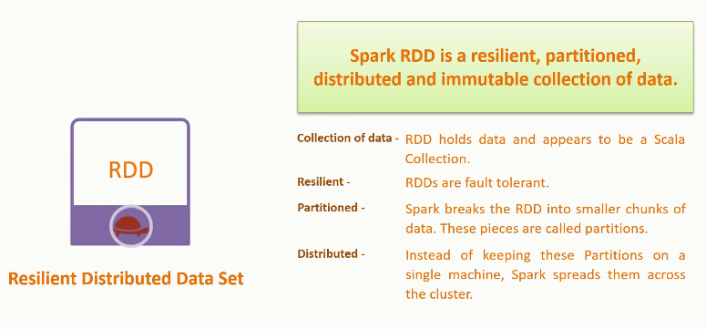

# Spark Design Architecture
- Spark is a distributted computing platform mostly used in bigdata processing

**Spark Streaming** 
- Is a real-time processing tool that runs on top of the Spark engine.
- it enables high-throughput, fault-tolerant stream processing of live data streams. 
- Why spark-streaming
    - https://www.datanami.com/2015/11/30/spark-streaming-what-is-it-and-whos-using-it/
    - Read from Kafka in parallel. In Kafka, a topic can have N partitions, and ideally we’d like to parallelize reading from those N partitions.
    - Real-time processing - Motivation of this project is to process events as they arrive
    - Write to Kafka from a Spark Streaming application, also, in parallel.
    - provides ability to stream different datatypes like rdd

- Read more: http://spark.apache.org/docs/1.1.1/streaming-programming-guide.html
    
   
    
## From kafka to spark engine

- Spark Streaming provides a high-level abstraction called discretized stream or DStream,
which represents a continuous stream of data. 
- DStreams can be created either from input data stream from sources such as Kafka,
- Internally, a DStream is represented as a sequence of RDDs.

### RDD 
- Resilient Distributed Datasets (RDD) is a fundamental data structure of Spark. 
    - It is  immutable so as many structures in scala
    - RDD is divided into logical partitions, which may be computed on different nodes of the cluster.
   

- http://spark.apache.org/docs/1.1.1/streaming-programming-guide.html

## How spark works
 

 

 
## Quickstart guide
Download latest Apache Kafka [distribution](http://kafka.apache.org/downloads.html) and un-tar it. 

Start ZooKeeper server:

    ./bin/zookeeper-server-start.sh config/zookeeper.properties

Start Kafka server:

    ./bin/kafka-server-start.sh config/server.properties

Create input topic:

    ./bin/kafka-topics.sh --create --zookeeper localhost:2181 --replication-factor 1 --partitions 3 --topic input

Create output topic:

    ./bin/kafka-topics.sh --create --zookeeper localhost:2181 --replication-factor 1 --partitions 3 --topic output

Start Kafka producer:

    ./bin/kafka-console-producer.sh --broker-list localhost:9092 --topic input

Start Kafka consumer:

    ./bin/kafka-console-consumer.sh --bootstrap-server localhost:9092 --topic output
    
## TODO: Who will control spark cluster
- Default is spark standalone but we have better services

## REF
https://www.tutorialspoint.com/apache_kafka/apache_kafka_integration_spark.htm
http://www.michael-noll.com/blog/2014/10/01/kafka-spark-streaming-integration-example-tutorial/
    
    